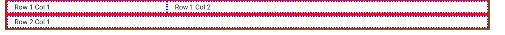
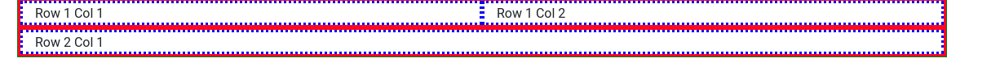
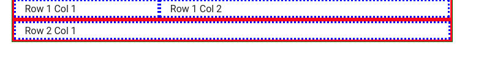
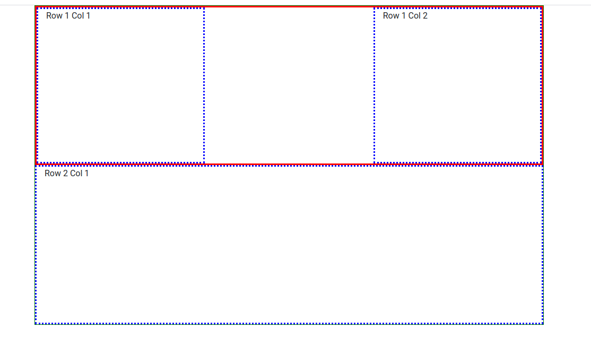

## Credit for the blog

Thanks to Maximilian Schwarzmüller from [Academind](https://academind.com/) for the excellent youtube video which helped me understand the grid layout. 

<a href="https://www.youtube.com/watch?v=qmPmwdshCMw
" target="_blank"></a>

## Code used for this blog

 Code used for this blog is available [here]. 
## Bootstrap grid layout.

- Bootstrap grid layout are inspired from flexbox and easy to understand if you know flexbox. 
- Anything inside `.container` is part of the bootstrap grid layout.

### There are 12 coloumns available in a row. 

- There are 12 coloumns available in a row. Space is divided based on the width speciified in the `col` class

```html
<div class="container my-container">
        <div class="row my-row">
            <div class="col-4 my-col">
                Row 1 Col 1
            </div>
            <div class="col-8 my-col">
                Row 1 Col 2
            </div>
        </div>
        <div class="row my-row">
            <div class="col my-col">
                Row 2 Col 1
            </div>
        </div>
    </div>
```

In this instance `Row 1 Col 1` qill get 4 out of 12 and `Row 1 Col 2` will get 8 as seen in the below image



### Responsive breakpoints

We can use responsive break points to control how images are displayed on in different screen size. 

Following is the responsive points in bootstrap

```css
// Extra small devices (portrait phones, less than 576px)
// No media query for `xs` since this is the default in Bootstrap

// Small devices (landscape phones, 576px and up)
@media (min-width: 576px) { ... } //sm

// Medium devices (tablets, 768px and up)
@media (min-width: 768px) { ... } //md

// Large devices (desktops, 992px and up)
@media (min-width: 992px) { ... } //lg

// Extra large devices (large desktops, 1200px and up)
@media (min-width: 1200px) { ... } //xl
```

What s intetesting is this line from the above snippet _No media query for `xs` since this is the default in Bootstrap_. What this essentially means is that bootstrap is a mobile first framework. 

The following snippet is an example of this responsiveness in action. 

```html
 <div class="container my-container">
        <div class="row my-row">
            <div class="col-md-4 col-lg-6 my-col">
                Row 1 Col 1
            </div>
            <div class="col-md-8 col-lg-6 my-col">
                Row 1 Col 2
            </div>
        </div>
        <div class="row my-row">
            <div class="col my-col">
                Row 2 Col 1
            </div>
        </div>
    </div>
```

At a pixel size of greater than 992px `Row 1 Col 1` and `Row 1 Col 2` will have 6 coloumns each. 



Anytime the pixel size falls to less than 992 px then the spacing will be split to 4 and 8



### Moving stuff within layout. 

Bootstrap uses a flexbox inspired approach to move coloums within a grid. 

The below snippet 

```html
  <div class="container my-container">
        <div class="row my-row justify-content-between my-row-big">
            <div class="col-4 my-col">
                Row 1 Col 1
            </div>
            <div class="col-4 my-col">
                Row 1 Col 2
            </div>
        </div>
        <div class="row my-row-big">
            <div class="col my-col">
                Row 2 Col 1
            </div>
        </div>
    </div>
```

will look as follows




The key here is the `justify-content-between` class which will push `Row 1 Col 1` and `Row 1 Col 2` to both extremes. This is clearly inspired from flexbox and the names of the classes are quite similiar


